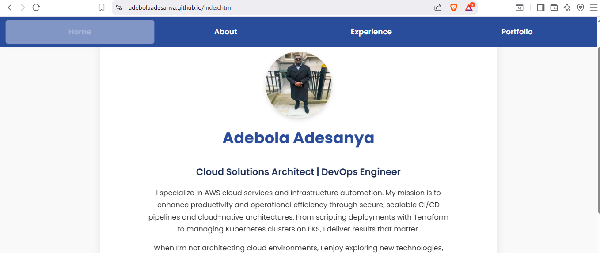

# 🌐 Adebola Adesanya - DevOps Portfolio Website

This repository hosts my professional **DevOps Portfolio Website**, built using HTML, CSS, and JavaScript and deployed via **GitHub Pages** with an automated **CI/CD pipeline using GitHub Actions**. It highlights my cloud projects, professional background, certifications, and modern front-end engineering practices.

> 📍 **Live Site**: [adebolaadesanya.github.io](https://adebolaadesanya.github.io)

---

## 🗂 Project Structure

The site is composed of the following statically served HTML pages:

| Page             | Purpose                                                                 |
|------------------|-------------------------------------------------------------------------|
| `index.html`     | Landing page featuring professional intro and quick overview            |
| `about.html`     | Detailed background, experience, certifications, and personal interests |
| `portfolio.html` | A collection of selected DevOps and cloud projects                      |
| `assets/`        | CSS, images, icons, and JS files supporting the site                    |

---

## 🚀 Deployment: GitHub Pages

The website is deployed automatically to GitHub Pages using the `gh-pages` branch. No manual deployment is required.

- **Branch**: `main`
- **Build Target**: Static HTML/CSS/JS
- **Deployed To**: `https://adebolaadesanya.github.io/`

> Deployment happens automatically on every commit to the `main` branch using GitHub Actions.

---

## ⚙️ CI/CD: GitHub Actions Workflow

The repository uses a GitHub Actions workflow to build and deploy the portfolio:

### 📄 `.github/workflows/deploy.yml`

```yaml
name: Deploy to GitHub Pages

on:
  push:
    branches:
      - main

jobs:
  deploy:
    runs-on: ubuntu-latest
    steps:
      - name: Checkout Repository
        uses: actions/checkout@v3

      - name: Setup Node.js
        uses: actions/setup-node@v3
        with:
          node-version: 18

      - name: Deploy Static Site to GitHub Pages
        uses: peaceiris/actions-gh-pages@v3
        with:
          github_token: ${{ secrets.GITHUB_TOKEN }}
          publish_dir: ./

🔁 Workflow Summary

Triggered on every push to main

Ensures the latest HTML, CSS, and JS files are deployed

Uses peaceiris/actions-gh-pages for publishing

No manual build steps required since the project is purely static

💡 Features

📱 Responsive Design: Works across devices

🎯 Highlight Active Page: Menu shows which page you're currently on

🔍 Project Filtering: JavaScript-powered filtering on the portfolio.html page

🌙 Dark Mode Ready: Theme extensibility planned

🧠 DevOps Focus: Projects focus on AWS, Docker, Terraform, EKS, and automation

🛠 Technologies Used

HTML5 & CSS3

Vanilla JavaScript

Font Awesome Icons

GitHub Pages for hosting

GitHub Actions for CI/CD

📸 Screenshots

Homepage preview


Project cards with filtering on Portfolio page

📌 How to Contribute

If you'd like to fork or extend this template for your own DevOps portfolio:

Fork this repository

Edit the HTML pages with your content

Push changes to your own main branch

Enable GitHub Pages in your repository settings

Copy or adapt the .github/workflows/deploy.yml file to automate deployment

🧾 License

This project is open-source and available under the MIT License.

👨‍💻 Author

Adebola Adesanya
DevOps Engineer | AWS & Azure | Cloud Automation
📍 **Visit Portfolio**: [adebolaadesanya.github.io](https://adebolaadesanya.github.io)


---
